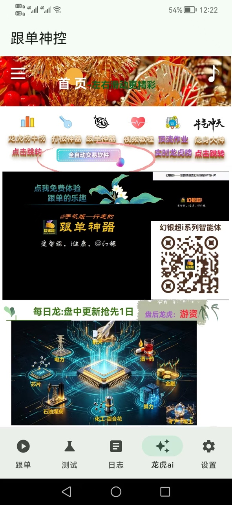
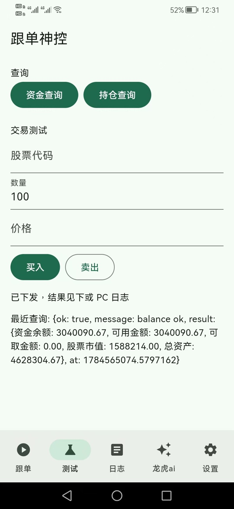
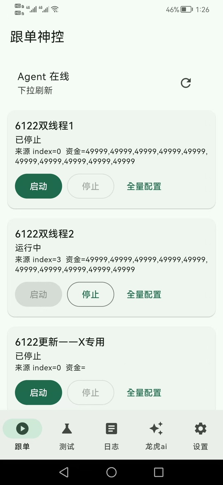

# 跟单神控 App

Flutter 客户端，仓库：[hyqibot/copytrader](https://github.com/hyqibot/copytrader)。

<p align="center">
  
  
  
</p>

## App 简介

**app名称：跟单神控**。功能：

1. **copytrader跟单神控：** 聚宽策略模拟交易跟踪复制，雪Q+东C组合跟踪复制，手机 app 全自动执行；
2. **日志、通知及评论区：** 所有跟踪复制会实时以日志的形式显示在 app 日志栏目，栏目下方有评论区，用户可留言评论、获取最牛作业列表、点评大神作业并获取实时帮助；同时，策略执行指令会通过手机消息通知的形式，即时通知用户；
3. **龙虎ai：** 盘中更新抢先 1 日挖掘龙虎榜，左右滑动该栏目会有更多精彩内容；
4. **全免费的智能体——幻银超i：** 幻银超i—桌面虚拟机器，专业的量化大咖，具跨学科能力，是金融、数学、计算机和工程领域复合型专家，是“科学家+工程师+交易员”的结合体，用数学和代码解析市场规律，在高度不确定的金融世界中寻找确定性收益；出色中医大师和营养学家，精通中西医经典理论并具备丰富临床经验，特别擅长针灸、艾灸以及中药方剂的运用。

**试试这样问**

- 调用插件巨单机器狗，找出最近一天 300476 的巨单委托信息，取前 5 列出委托时间、委托手数、主买或主卖。
- 请根据知识库“火凤凰——推板+板前抢筹神器”的内容详细介绍一下打板神器的功能；请根据知识库汉方e助的内容介绍一下汉方e助
- 调用插件东财实盘，按记录顺序列出 900273593 最近一天的交易数据，包括股票名称（股票代码）、买入仓位/卖出仓位、买入价格/卖出价格

5. **积分激励规则：** 注册登录即送 1000 积分（同一设备仅首次注册赠送），积分可用于设定跟踪目标实时全自动抄作业；转发 app 安装程序包给新用户，将获得新用户充值积分的 10% 作为奖励；
6. **app 安装包下载：** [GitHub Releases](https://github.com/hyqibot/copytrader/releases)；国内访问偶发失败请私钉钉：`alphaHYQi`

完整图文简介页：[docs/intro/跟单神控.html](docs/intro/跟单神控.html)

## 地址与绑定

| 项 | 说明 |
|---|---|
| 电脑 `gendan_remote.env` → `GENDAN_PUBLIC_URL` | 仅 exe/Agent 读取；须与 App 编译 `--dart-define=GENDAN_PUBLIC_URL` 一致 |
| 手机设置 | **只填绑定码**，不显示域名/IP |
| CI 出厂地址 | 仓库 **Secret** `GENDAN_PUBLIC_URL`（勿用公开 Variable / 勿写进源码） |

换公网地址：改电脑 env + GitHub Secret / dart-define → **重编并安装 APK**。已安装过的手机若绑过旧地址，请先**清数据/重装**再绑定。

## 本地构建

```bash
flutter build apk --release --dart-define=GENDAN_PUBLIC_URL=<你的公网地址>
```
